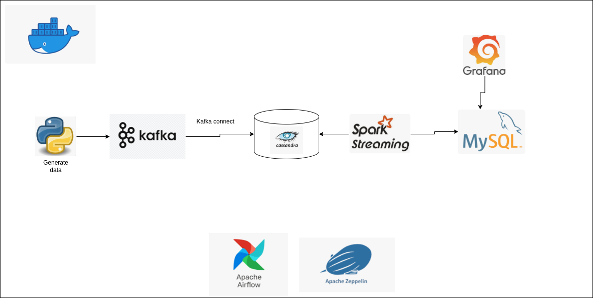
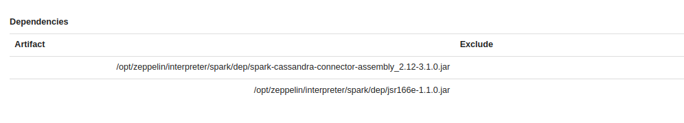

## Introduction

Project engineer project about bulding data pipeline which consume log data from user of recuirment website. The main goal is store, process and analyze data for DA team. 


Tech stack: PySpark, Airflow, Kafka, Docker, Cassandra, MySQL, Grafana, Python.

## Architecture diagram




## How it works

**Data genratation**

- Airflow is responsible for the execution of python script. It run every seconds for generating real-time data.

**Data flow**

- Python script produce data into kafka topic. Than Kafka connect auto consume data from topic and push it into cassadandra.
- Spark run in zeppelin for easy manager notebook code.
- Spark streaming is used to auto process newest data from cassandra using CDC, than push new data into data warehouse (mysql).

**Daia vizualization**
- Using garfana for vizualize data.

## Setup project


**Spark & zeppelin**
- Config for use the PYSPARK_DRIVER_PYTHON, PYSPARK_PYTHON in each spark node
```
RUN echo "PYSPARK_DRIVER_PYTHON=/opt/bitnami/python/bin/python3" >> /opt/bitnami/spark/conf/spark-env.sh && \
    echo "PYSPARK_PYTHON=/opt/bitnami/python/bin/python3" >> /opt/bitnami/spark/conf/spark-env.sh
```
- Mount volumn in zeppelin and spark 
```
      - zeppelin:/opt/zeppelin/
      - spark-master-data:/opt/bitnami/spark/
      - python-exe-spark:/opt/bitnami/python
```
- Setup spark connection library to cassandra can not set in $spark.conf, must set in jar folder of the spark master
- Or set up in intertepert in zeppelin to distribute the jar file into spark cluster

  

**Kafka connect**

Download cassandra sink and tar it.
```
        wget https://downloads.datastax.com/kafka/kafka-connect-cassandra-sink.tar.gz
        tar -xvf kafka-connect-cassandra-sink.tar.gz -C /usr/share/confluent-hub-components/
```
Send api request to create connector
```
curl -X POST http://localhost:8083/connectors -H "Content-Type: application/json" -d '{
    "name": "cassandra-sink2",
    "config": {
        "connector.class": "com.datastax.oss.kafka.sink.CassandraSinkConnector",
        "tasks.max": "1",
        "topics": "gen_data4",
        "contactPoints": "172.18.0.6",
        "loadBalancing.localDc": "datacenter1",
        "port": "9042",
        "auth.provider": "PLAIN",
        "auth.username": "cassandra",
        "auth.password": "cassandra",
        "topic.gen_data4.bedan.tracking.mapping": "bid=value.bid,campaign_id=value.campaign_id,create_time=value.create_time,custom_track=value.custom_track,group_id=value.group_id,job_id=value.job_id,publisher_id=value.publisher_id,ts=value.ts",
        "topic.gen_data4.bedan.tracking.ttlTimeUnit": "SECONDS",
        "topic.gen_data4.bedan.tracking.timestampTimeUnit": "MICROSECONDS",
        "ssl.provider": "None",
        
        "key.converter": "org.apache.kafka.connect.storage.StringConverter",
        "value.converter": "org.apache.kafka.connect.json.JsonConverter",
        "key.converter.schemas.enable": "false",
        "value.converter.schemas.enable": "false"
    }
}'
```

### Processing Data
Raw Data

```
.
root
 |-- create_time: string (nullable = false)
 |-- bid: integer (nullable = true)
 |-- bn: string (nullable = true)
 |-- campaign_id: integer (nullable = true)
 |-- cd: integer (nullable = true)
 |-- custom_track: string (nullable = true)
 |-- de: string (nullable = true)
 |-- dl: string (nullable = true)
 |-- dt: string (nullable = true)
 |-- ed: string (nullable = true)
 |-- ev: integer (nullable = true)
 |-- group_id: integer (nullable = true)
 |-- id: string (nullable = true)
 |-- job_id: integer (nullable = true)
 |-- md: string (nullable = true)
 |-- publisher_id: integer (nullable = true)
 |-- rl: string (nullable = true)
 |-- sr: string (nullable = true)
 |-- ts: string (nullable = true)
 |-- tz: integer (nullable = true)
 |-- ua: string (nullable = true)
 |-- uid: string (nullable = true)
 |-- utm_campaign: string (nullable = true)
 |-- utm_content: string (nullable = true)
 |-- utm_medium: string (nullable = true)
 |-- utm_source: string (nullable = true)
 |-- utm_term: string (nullable = true)
 |-- v: integer (nullable = true)
 |-- vp: string (nullable = true)
```

Clean data in data warehouse

```
root
 |-- job_id: integer (nullable = true)
 |-- dates: timestamp (nullable = true)
 |-- hours: integer (nullable = true)
 |-- disqualified_application: integer (nullable = true)
 |-- qualified_application: integer (nullable = true)
 |-- conversion: integer (nullable = true)
 |-- company_id: integer (nullable = true)
 |-- group_id: integer (nullable = true)
 |-- campaign_id: integer (nullable = true)
 |-- publisher_id: integer (nullable = true)
 |-- bid_set: double (nullable = true)
 |-- clicks: integer (nullable = true)
 |-- impressions: string (nullable = true)
 |-- spend_hour: double (nullable = true)
 |-- sources: string (nullable = true)
 |-- latest_update_time: timestamp (nullable = true)
```